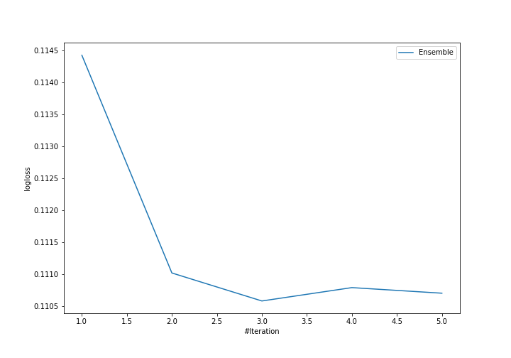
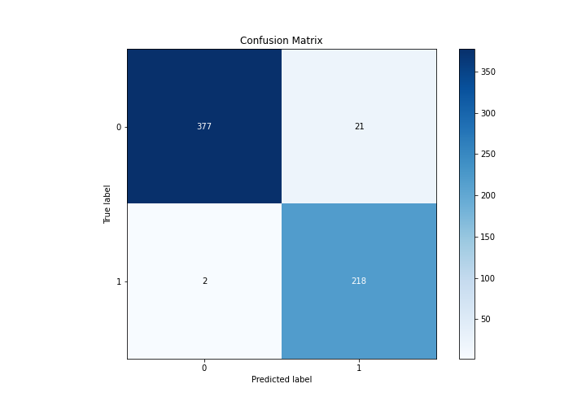
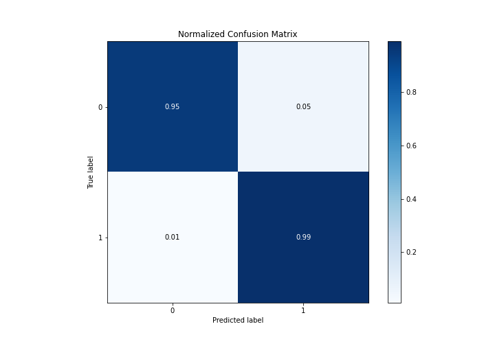
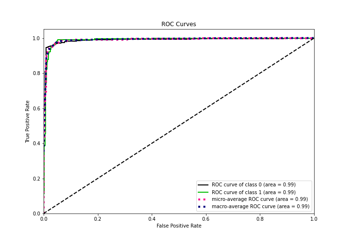
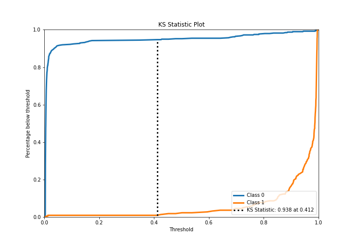
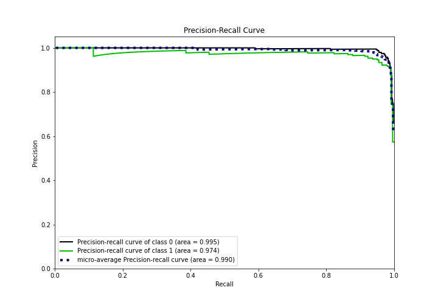
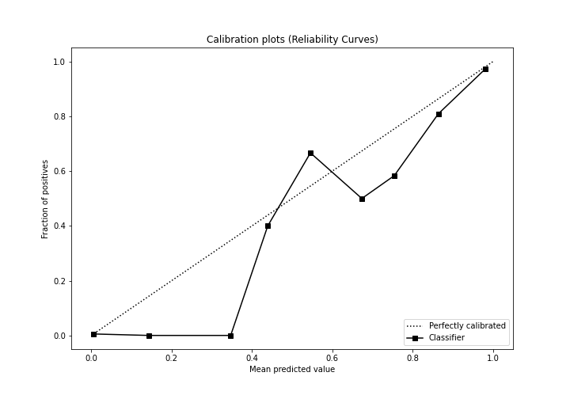
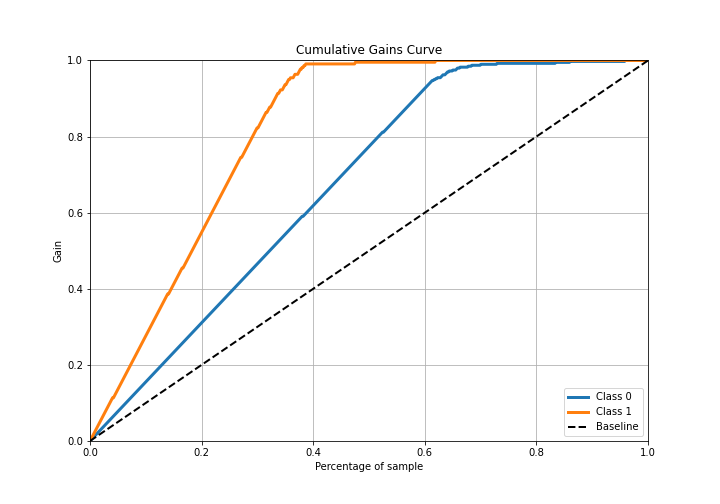
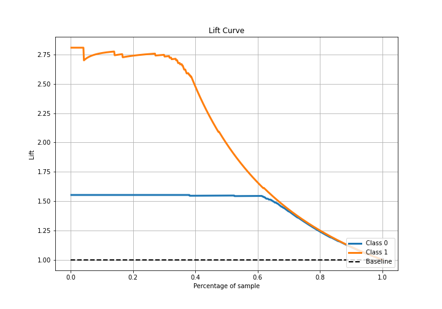

# Summary of Ensemble

[<< Go back](../README.md)

## Ensemble structure
| Model                   |   Weight |
|:------------------------|---------:|
| 3_Default_Xgboost       |        2 |
| 4_Default_NeuralNetwork |        1 |

## Metric details
|           |    score |    threshold |
|:----------|---------:|-------------:|
| logloss   | 0.110586 | nan          |
| auc       | 0.989242 | nan          |
| f1        | 0.949891 |   0.418862   |
| accuracy  | 0.962783 |   0.418862   |
| precision | 1        |   0.994073   |
| recall    | 1        |   0.00328183 |
| mcc       | 0.922368 |   0.418862   |

## Metric details with threshold from accuracy metric
|           |    score |   threshold |
|:----------|---------:|------------:|
| logloss   | 0.110586 |  nan        |
| auc       | 0.989242 |  nan        |
| f1        | 0.949891 |    0.418862 |
| accuracy  | 0.962783 |    0.418862 |
| precision | 0.912134 |    0.418862 |
| recall    | 0.990909 |    0.418862 |
| mcc       | 0.922368 |    0.418862 |

## Confusion matrix (at threshold=0.418862)
|              |   Predicted as 0 |   Predicted as 1 |
|:-------------|-----------------:|-----------------:|
| Labeled as 0 |              377 |               21 |
| Labeled as 1 |                2 |              218 |

## Learning curves

## Confusion Matrix

## Normalized Confusion Matrix

## ROC Curve

## Kolmogorov-Smirnov Statistic

## Precision-Recall Curve

## Calibration Curve

## Cumulative Gains Curve

## Lift Curve

[<< Go back](../README.md)
